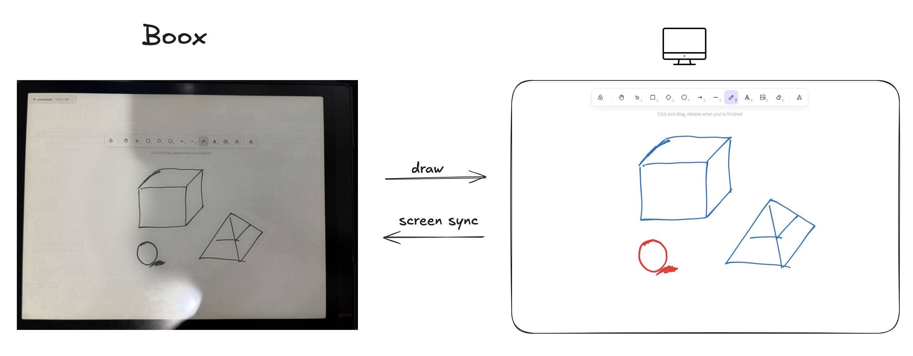

# Boox Display Digitizer

Turn your Boox e-ink tablet into a wireless pen digitizer for your Mac. Stylus strokes inject as mouse events; the Mac screen mirrors back so you can see where you're drawing.



## Features

- Pen → mouse injection at ~200 Hz, with eraser → right-click
- Mac screen mirrored to Boox as grayscale JPEG (0.5–5 fps)
- Two-finger pan & zoom on the mirrored view
- Auto-discovery on the LAN, with per-connection Allow/Deny prompt
- macOS menu bar app

## Quick start

**Pre-built:** download the latest DMG and APK from [Releases](https://github.com/zhattention/boox-display-digitizer/releases).

**From source:**

```bash
# Mac server
cd server && python3 -m venv .venv && source .venv/bin/activate
pip install -r requirements.txt && python server.py

# Boox app
source env.sh && cd android && ./gradlew installDebug
```

First run on Mac prompts for **Accessibility** and **Screen Recording** permission.
First install on Boox needs Onyx SDK access:

```bash
adb shell pm grant com.boox.bridge android.permission.WRITE_SECURE_SETTINGS
```

Open the app on the Boox — it finds the server automatically.

## Configuration

| Variable | Default | Description |
|---|---|---|
| `BOOX_BRIDGE_PORT` | `9999` | WebSocket port |
| `BOOX_BRIDGE_FPS_INTERVAL` | `1` | Screenshot push interval (seconds) |

Push interval is also adjustable at runtime from the menu bar.

## Compatibility

- **Mac:** macOS 12+ (Intel and Apple Silicon)
- **Boox:** Tab X and other Onyx devices with Pen SDK (Android 9+)
- Works in any app that takes mouse input — ClassIn, Freeform, Excalidraw, Photoshop, etc.

## License

MIT
